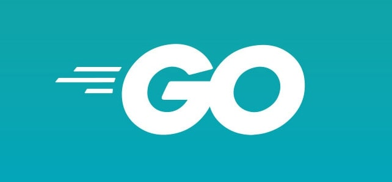

# Activitat de recerca de llenguatges de programació

## Python:

### • Naixement, creadors i evolució històrica.

Python va apareixer per primer cop al 1991 i va ser creat per Guido van Rossum. 

 
 
### • Característiques del llenguatge. 

◦ Imperatiu, declaratiu, OOP... 

Tot i que el seu punt fort és la programació orientada a objectes també es pot fer servir la programació imperativa o funcional.

◦ Compilat, interpretat, híbrid... 

És un llenguatge interpretat.

◦ Principals novetats o aportacions respecte altres llenguatges. 

------------------------------------------------

◦ Avantatges i inconvenients respecte altres llenguatges. 

Avantatges:

1.És un llenguatge fàcil d'utilitzar i aprendre.

2.És un llenguatge de propòsit general.

3.És compatible amb tots els sistemes operatius.

4.És gratuit i de codi obert.

Inconvenients:

1.Consumeix molta memòria.

2.No es adecuat per al desenvolupament en dispositius mòvils.

3.És lent.

### • Principals entorns on es fa servir el llenguatge. 

--------------------------------

### • Exemple de codi (valoraré especialment si mostreu que ho heu implementat i provat) 

◦ Hola mòn (Molt fàcil de trobar) 

`code` print("Hola mòn");

◦ Demanar el nom a l'usuari i mostrar-lo (haureu de buscar una mica més)

`code` nom=imput ("Quin es el teu nom?); print("hola "+ nom)

### • Buscar com estan les ofertes de treball a Infojobs del llenguatge. 

He estat buscant i hi ha bastantes ofertes de treball per gent que sap programar amb Python.

### • WebGrafia 

[HelloWorldPython](https://www.learnpython.org/en/Hello,_World!) 

## Java:

### • Naixement, creadors i evolució històrica. 

Java va apareixer per primer cop al 1996, el seu creador va ser James Gosling.

 

### • Característiques del llenguatge. 

◦ Imperatiu, declaratiu, OOP... 

Java és un llenguatge orientat a objectes.

◦ Compilat, interpretat, híbrid... 

És un llenguatge interpretat.

◦ Principals novetats o aportacions respecte altres llenguatges. 

--------------------------------------------------------------------

◦ Avantatges i inconvenients respecte altres llenguatges. 

Avantatges:

1.És multiplataforma.

2.És relativament fàcil d'aprendre comparat amb altres.

3.És un llenguatge segur. 

Inconvenients:

1.El rendiment en l'execució de programes pot ser lent.

2.És un llenguatge que requereix més codi per realitzar les mateixes tasques.

3.Requereix un espai de memòria significatiu.

### • Principals entorns on es fa servir el llenguatge. 

-----------------------------------------------------

### • Exemple de codi (valoraré especialment si mostreu que ho heu implementat i provat) 

◦ Hola mòn (Molt fàcil de trobar) 

`code` class HelloWorld {
    public static void main(String[] args) {
        System.out.println("Hello, World!"); 
    }
}

◦ Demanar el nom a l'usuari i mostrar-lo (haureu de buscar una mica més) 

`code`  

### • Buscar com estan les ofertes de treball a Infojobs del llenguatge. 

Al igual que en Python hi ha un gran nombre d'ofertes de feina.

### • WebGrafia

[Avantatges i inconvenients 1](https://darabit.com/java/ventajas-y-desventajas-de-java/)

[Avantatges i inconvenients 2](https://www.crehana.com/blog/desarrollo-web/ventajas-desventajas-java/)

[Avantatges i inconvenients 3](https://adictoalcodigo.blogspot.com/2016/07/ventajas-y-desventajas-de-programar-en.html#:~:text=Ventajas%20y%20desventajas%20de%20programar%20en%20JAVA%201,el%20responsable%20de%20esa%20tarea.%20...%20M%C3%A1s%20elementos)

[HelloWorldJava](https://www.programiz.com/java-programming/hello-world)

## C:

### • Naixement, creadors i evolució històrica. 

El llenguatge C va aparèixer per primer cop al 1972 i va ser creat per Dennis Ritchie.

 

### • Característiques del llenguatge. 

◦ Imperatiu, declaratiu, OOP... 

És un llenguatge imperatiu.

◦ Compilat, interpretat, híbrid...

És un llenguatge compilat.

◦ Principals novetats o aportacions respecte altres llenguatges. 

-------------------------------------------

◦ Avantatges i inconvenients respecte altres llenguatges. 

Avantatges:

1.És un llenguatge òptim i veloç.

2.Permet programar amb multiples estils.

3.Conjunt reduït de paraules claus.

Inconvenients:

1.El software pot ser lent si no s'utilitzen els punters de forma correcta.

2.No es un llenguatge visual.

### • Principals entorns on es fa servir el llenguatge. 

-----------------------------------------

### • Exemple de codi (valoraré especialment si mostreu que ho heu implementat i provat) 

◦ Hola mòn (Molt fàcil de trobar) 

`code`#include <stdio.h>
int main() {

   printf("Hello, World!");
   return 0;
}

◦ Demanar el nom a l'usuari i mostrar-lo (haureu de buscar una mica més) 

`code`

### • Buscar com estan les ofertes de treball a Infojobs del llenguatge. 

Totes les ofertes que trobo al Infojobs són de C# o C++.

### • WebGrafia 

[Que es C](https://openwebinars.net/blog/que-es-c/)

[Avantatges i inconvenients](https://sites.google.com/site/libreoficecalsk/home/desventajas)

[Avantatges i inconvenients](https://gigatecno.blogspot.com/2014/05/ventajas-y-desventajas-de-programar-en-c.html)

[HelloWorldC](https://www.programiz.com/c-programming/examples/print-sentence) 

## Go:

### • Naixement, creadors i evolució històrica. 

Go és un llenguatge que va apareixer al 2009, va ser desenvolupat per Google i els seus dissenyadors inicials van ser Robert Griesemer, Rob Pike i Ken Thompson.

### • Característiques del llenguatge. 

◦ Imperatiu, declaratiu, OOP... 

És un llenguatge orientat a objectes.

◦ Compilat, interpretat, híbrid... 

És compilat.

◦ Principals novetats o aportacions respecte altres llenguatges. 

------------------------------------------------

◦ Avantatges i inconvenients respecte altres llenguatges. 

Avantatges:

1.És un llenguatge amb una sintaxis clara, neta i organitzada.

2.Té un recol·lector automatic de basura.

3.Temps de compilació ràpid.

4.El seu rendiment és molt bo.

Inconvenients:

1.No admet herencia de tipus.

2.No admet afirmacions.

### • Principals entorns on es fa servir el llenguatge. 

-----------------------------------------------

### • Exemple de codi (valoraré especialment si mostreu que ho heu implementat i provat) 

◦ Hola mòn (Molt fàcil de trobar)

`code`import "fmt"

func main() {
	fmt.Println("Hello world")
}

◦ Demanar el nom a l'usuari i mostrar-lo (haureu de buscar una mica més) 

### • Buscar com estan les ofertes de treball a Infojobs del llenguatge.

A Infojobs he trobat unes quantes ofertes de feina. Hi ha més demanda en Java i Python.

### • WebGrafia 

[HelloWorldGo](https://go.dev/)
[Avantatges Go](https://www.mytaskpanel.com/lenguaje-programacion-go/#:~:text=Caracter%C3%ADsticas%20de%20Go%201%20Simplicidad.%20Este%20lenguaje%20tiene,programas%20y%20librer%C3%ADas%20utiliz%C3%A1ndolo.%205%20Lenguaje%20compilado.%20)
[Avantatges i inconvenients Go](https://www.codetd.com/es/article/12576086)

